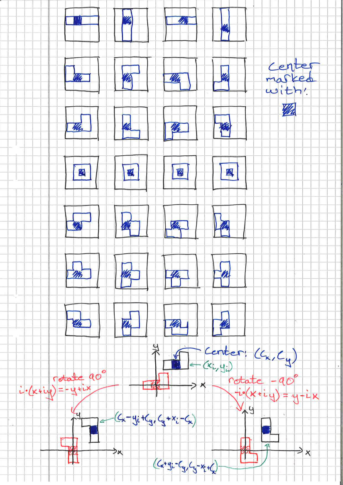

# tetris
Tetris implemented in Rust for both Native and WASM. Play it [here](https://NilsVreman.github.io/tetris/).

The app is written in Rust using [egui](https://github.com/emilk/egui/) and [eframe](https://github.com/emilk/egui/tree/master/crates/eframe).


## Rules
* Board: 10 x 20 bricks (width x height)
* Blocks: `I`, `J`, `L`, `O`, `S`, `T`, `Z`
* Rotation: Clockwise and counter-clockwise.
  If there is no space for the piece in its new orientation, it does not rotate.
* Every 1000 points, the difficulty (gravity) increases

| Key Bindings | Functionality |
|:------------:|:-------------:|
| `H` or `ArrowLeft` | Shift block Left |
| `L` or `ArrowRight` | Shift block Right |
| `K` or `ArrowUp` | Rotate block Left |
| `J` or `ArrowDown` | Rotate block Right |
| `Space` | Hard Drop |
| `R` | Restart Game |
| `Q` or `Esc` | Quit game (if on `native`) |


## Point system
Points are handed out when lines are removed:

```
Single line: 11 p
Double line: 29 p
Triple line: 67 p
Tetris:      103 p
```


## TODO:
* Mention installation process:
    1. sudo dnf ...
    2. .cargo file and that it is appended to cargo commands
    3. #dev thingy
    4. how to host it locally
    5. How to run in natively.
    6. other?


## Compilation - Local

The [eframe](https://github.com/emilk/egui/tree/master/crates/eframe) framework supports being compiled down to an ordinary desktop app *and* to web assembly (WASM). This can be done via normal cargo commands, e.g., `cargo run`, `cargo build --release` etc.

However, on Linux you need to first run:

`sudo apt-get install libxcb-render0-dev libxcb-shape0-dev libxcb-xfixes0-dev libspeechd-dev libxkbcommon-dev libssl-dev`

On Fedora Rawhide you need to run:

`dnf install clang clang-devel clang-tools-extra speech-dispatcher-devel libxkbcommon-devel pkg-config openssl-devel libxcb-devel fontconfig-devel`


## Compilation - WASM

[Trunk](https://trunkrs.dev/) is used to compile the rust code to Wasm and then package the necessary HTML and JavaScript wrappers into a complete webpage. Trunk can be intalled via cargo, i.e., `cargo install --locked trunk`. Make sure the `wasm32-unknown-unknown` target for `rustc` is installed, if you are using `rustup` this can be done with `rustup target add wasm32-unknown-unknown`.

* `trunk serve` will serve the webpage on `127.0.0.1:8080` and automatically rebuild if any files are changed.
* `trunk build --release` will build a release version of the webpage into the `dist` directory.

Note, the JS wrapper is set up to cache the Wasm app which cause problem when developing. The caching can be bypassed by requesting the `index.html#dev` page.


## Rotation Scheme


